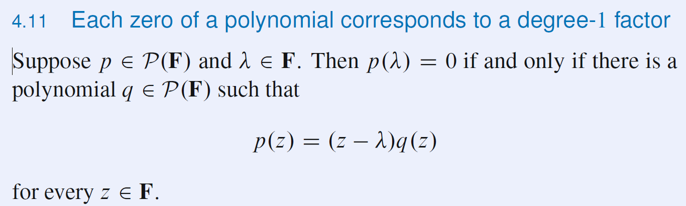
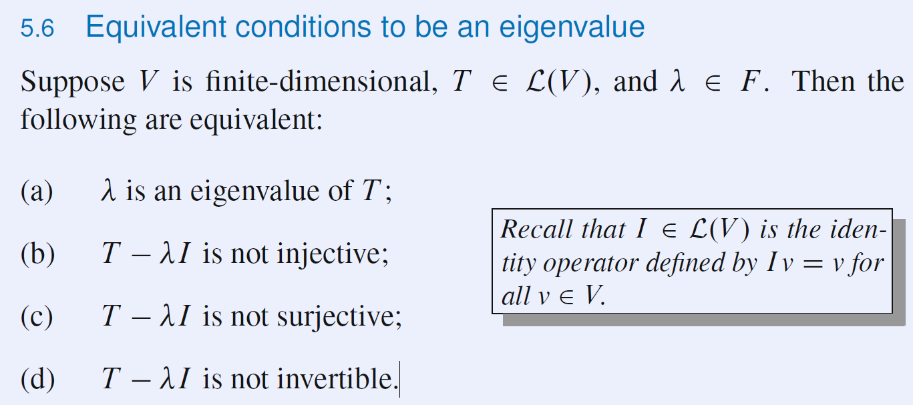
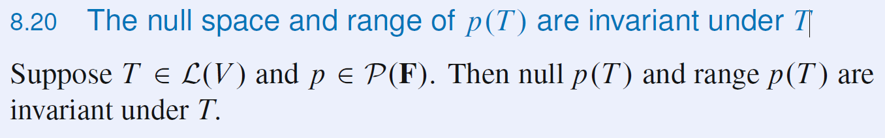

# Linear Algebra Done Right
## C1
### properties of complex arithmetic

$ F=R\cup C$
Elements of F are called scalars.
A list of length n = an n-tuple.
A list of length 0: ().

$ F^n $ is the set of lists of length n of elements of $F$:
$$ F^n=\{(x_1,\cdots,x_n):x_j\in F\ for\ j=1,\cdots,n\} $$
$x_j$is the $j^{th}$ coordinate of $(x_1,\cdots,x_n)$.
0 denotes the list of length n whose coor are all 0

scalar multiplication in $F^n$
$$ \lambda (x_1,\cdots,x_n)=(\lambda x_1, \cdots,\lambda x_n) $$
here $ \lambda \in F$ and $x\in F^n $

### field

### Definition of Vector Space
The motivation for the definition of a vector space comes from properties of addition and scalar multiplication in $F^n$: 
* Addition is commutative, associative, and has an identity. Every element has an additive inverse.
* Scalar multiplication is associative. Scalar multiplication by 1 acts as expected.

$R^n$ is a vector space over $R$, and $C^n$ is a vector space over $C$.
Elements of a vector space are called vectors or points.

$F^n$ and $F^\infty$, are special cases of the vector space $F^S$
we can think of $F^n$ as $F^{\{1,2,\cdots,n\}}$.
#### Unique additive inverse and identity inverse
A vector space has a unique additive identity.
Every element in a vector space has a unique additive inverse.

Because additive inverses are unique, the following notation now makes sense:
* $-v$ denotes the additive inverse of $v$
* $w - v$ is defined to be $w +(-v)$.

declaration once and for all:
$V$ denotes a vector space over $F$.
0 denotes a scalar (the number $0\in F$) on the left side of the equation and a vector (the additive identity of $V$) on the right side of the equation.
$$ 0v = 0,\forall v \in V. $$
Proof.
$$ 0v = (0 + 0)v = 0v + 0v $$
The only part of the definition of a vector space that connects scalar multiplication and vector addition is the distributive property. Thus the distributive property must be used in the proof.

$$ a0 = 0, \forall a \in F $$
$$(-1)v = -v,\forall v \in V $$

### subspace
A subset U of V is called a subspace of V if U is also a vector space (using the same addition and scalar multiplication as on V).

Example $\{(x1,x2,0):x1,x2\in F\}$ is a subspace of $F^3$

linear subspace = subspace

#### sum of subsets
is the set of all possible sums of elements of $U_1,U_2,\cdots,U_m$

the sum of subspaces is a subspace, and is in fact the smallest subspace containing all the summands

Sums of subspaces in the theory of vector spaces are analogous to unions of subsets in set theory.

#### direct sum

condition for a direct sum
$$ \sum_j u_j,\forall j,u_j\in U_j,u_j=0$$

direct sum of two subspaces
Suppose $U$ and $W$ are subspaces of $V$. Then $U + W$ is a direct sum if and only if $U \cap W=\{0\}$

## Finite-Dimensional Vector Spaces
We will usually write lists of vectors without surrounding parentheses.
### Linear Combinations and Span
linear combination of a list $v_1,\cdots,v_m$ of vectors in $V$ is a vector of the form
$$ a_1v_1+\cdots+a_mv_m $$
where $a_i\in F$
$ span(v_1,\cdots,v_m)=\{ a_1v_1 +\cdots+ a_mv_m:a_i\in F\} $
linear span = span
The span of a list of vectors in V is the smallest subspace of V containing all the vectors in the list.
If $span(v_1,\cdots,v_m)=V$, we say that $v_1,\cdots, v_m$ spans $V$.
A vector space is called finite-dimensional if some list of vectors in it spans the space.
Recall that by definition every list has finite length.

#### polynomial, $\mathcal{P}(F)$

**TAKE POLYNOMIAL AS A FUNCTION!**
$\mathcal{P}(F)$ is a vector space over $F$.**WHY**
$\mathcal{P}(F)$ is a subspace of $F^F$, the vector space of functions from $F$ to $F$.

coefficients of a polynomial are uniquely determined by the polynomial. Thus:

$\mathcal{P}_m(F)=span(1,z,\cdots,z^m)$
$\mathcal{P}_m(F)$ is a finite-dimensional vector space for each nonnegative integer m.

### Linear Independence

(b) is important.
Length of linearly independent list <= length of spanning list

### Bases
Bring the privous concept together.

A basis of V is a list of vectors in V that is linearly independent and spans V.

Every spanning list in a vector space can be reduced to a basis of the vector space.

Every finite-dimensional vector space has a basis.
* proof
By definition, a finite-dimensional vector space has a spanning list.
The previous result tells us that each spanning list can be reduced to a basis.

Every linearly independent list of vectors in a finite-dimensional vector space can be extended to a basis of the vector space.

### Dimension
Any two bases of a finite-dimensional vector space have the same length.

The dimension of a finite-dimensional vector space is the length of any basis of the vector space.
The dimension of V (if V is finite-dimensional) is denoted by dim V.

If V is finite-dimensional and U is a subspace of V, then dim U <= dim V.

Suppose V is finite-dimensional. Then every linearly independent list of vectors in V with length dim V is a basis of V.

Suppose V is finite-dimensional. Then every spanning list of vectors in V with length dim V is a basis of V.

If U1 and U2 are subspaces of a finite-dimensional vector space, then 
$$ dim(U_1 + U_2)=dim U_1 + dim U_2 - dim(U1 \cap U2) $$

## Linear Maps
No one gets excited about vector spaces. The interesting part of linear algebra is the subject to which we now turn—linear maps.

V and W denote vector spaces over F
### The Vector Space of Linear Maps
#### Definition and Examples of Linear Maps
linear transformation = linear maps

notation: $ T(v)=Tv $

The set of all linear maps from V to W is denoted $ \mathcal{L}(V,W) $

examples of linear maps:
* zero
$$ 0v=0 $$
The 0 on the left side of the equation above is a function from V to W, whereas the 0 on the right side is the additive identity in W.

* identity
$$ Iv=v $$
is the function on some vector space that takes
each element to itself

* differentiation
$$ Dp=p^\prime $$
$(f + g)^\prime = f^\prime + g^\prime$ and $(\lambda f)^\prime=\lambda f^\prime$ whenever $f, g$ are differentiable and $\lambda$ is a constant

* integration
$$ Tp=\int^1_0 p(x)dx $$
the integral of the sum of two functions equals the sum of the integrals, and the integral of a constant times a function equals the constant times the integral of the function

The existence part of the next result means that we can find a linear map that takes on whatever values we wish on the vectors in a basis. 
The uniqueness part of the next result means that a linear map is completely determined by its values on a basis.
* 3.5

Proof. Important! See P70.

### Algebraic Operations on $\mathcal{L}(V,W)$

With the operations of addition and scalar multiplication as defined above, $\mathcal{L}(V,W)$ is a vector space

Multiplication of linear maps is not commutative.

Suppose T is a linear map from V to W. Then $T(0)=0$.

### Null Spaces and Ranges
#### Null Space and Injectivity
kernel = null space
$null T=\{v\in V: Tv=0\}$
If T is the zero map from V to W, in other words if Tv = 0 for every v $\in$ V, then null T = V

Suppose $T\in \mathcal{L}(V,W)$. Then null T is a subspace of V.

A function $T: V \rightarrow W$ is called **injective** if $Tu = Tv$ implies $u = v$.
one-to-one = injective, T is injective if it maps distinct inputs to distinct outputs

* 3.16
Let $T\in \mathcal{L}(V,W)$. Then T is injective if and only if null T = {0}.

#### Range and Surjectivity
range = image
$ range\ T =\{Tv: v\in V\} $
If T is the zero map from V to W, in other words if Tv = 0 for every $v \in V$, then range T = {0}

If $T\in \mathcal{L}(V,W)$, then range T is a subspace of W.

A function $T: V\rightarrow W$ is called **surjective** if its range equals W.
surjective=onto

#### Fundamental Theorem of Linear Maps
Suppose V is finite-dimensional and $T: V \in \mathcal{L}(V,W)$. Then range T is finite-dimensional and 
$$dim\ V = dim\ null\ T + dim\ range\ T$$

Suppose V and W are finite-dimensional vector spaces such that dimV > dimW. Then no linear map from V to W is injective.

Suppose V and W are finite-dimensional vector spaces such that dimV < dimW. Then no linear map from V to W is surjective.

Homogeneous (齐次的), in this context, means that the constant term on the right side of each equation below is 0.

A homogeneous system of linear equations with more variables than equations has nonzero solutions./null T is strictly bigger than {0} / T is not injective
* range T={0}

An inhomogeneous system of linear equations with more equations than variables has no solution for some choice of the constant terms. range T is not equal to Fm / T is not surjective

### Matrices
#### Representing a Linear Map by a Matrix
the key definition in this section
* 3.32 Definition matrix of a linear map

#### Addition and Scalar Multiplication of Matrices
* 3.36 The matrix of the sum of linear maps
Suppose $S, T \in \mathcal{L}(V,M)$. Then $\mathcal{M}(S + T)=\mathcal{M}(S)+\mathcal{M}(T)$

* 3.38 The matrix of a scalar times a linear map
Suppose $S, T \in \mathcal{L}(V,M)$. Then $\mathcal{M}(\lambda T)=\lambda \mathcal{M}(T)$

* 3.39 Notation $F^{m,n}$
For m and n positive integers, the set of all m-by-n matrices with entries in F is denoted by $F^{m,n}$.

* 3.40 dim $F^{m,n}=mn$
Suppose m and n are positive integers. With addition and scalar multiplication defined as above, $F^{m,n}$ is a vector space with dimension mn.

In the following result, the assumption is that **the same basis of V** is used in considering $T\in \mathcal{L}(U,V)$ and $S\in \mathcal{L}(V,W)$, **the same basis of W** is used in considering $S\in \mathcal{L}(V,W)$ and $ST\in \mathcal{L}(U,W)$, and **the same basis of U** is used in considering $T\in \mathcal{L}(U,V)$ and $ST\in \mathcal{L}(U,W)$.
* 3.43 The matrix of the product of linear maps
If $T\in \mathcal{L}(U,V)$ and $S\in \mathcal{L}(V,W)$, then $\mathcal{M}(ST)=\mathcal{M}(S)\mathcal{M}(T)$

Understanding:
It is us who define the multiplication of Matrix. We select matrix to express linear transformation. We find a way to express the combination of linear maps, that is the multiplication of matrices.

* 3.47 Entry of matrix product equals row times column
$$(AC)_{j,k}=A_{j,\cdot}C_{\cdot,k}$$

* 3.49 Column of matrix product equals matrix times column
$$(AC)_{\cdot,k}=AC_{\cdot,k}$$

* 3.52

### Invertibility and Isomorphic Vector Spaces
* 3.56 Invertibility is equivalent to injectivity and surjectivity
A linear map is invertible if and only if it is injective and surjective.

* 3.58 Definition isomorphism, isomorphic
  * An isomorphism (同构体) is an invertible linear map.
  * Two vector spaces are called isomorphic if there is an isomorphism from one vector space onto the other one.

The terms “isomorphism” and “invertible linear map” mean the same thing.

The Greek word isos means equal; the Greek word morph means shape. Thus isomorphic literally means equal shape.

* 3.59 Dimension shows whether vector spaces are isomorphic
Two finite-dimensional vector spaces over F are isomorphic if and only if they have the same dimension.

* 3.61 $ dim\ \mathcal{L}(V,W)=(dim\ V)(dim\ W)$

#### Linear Maps Thought of as Matrix Multiplication
Previously we defined the matrix of a linear map. Now we define the matrix of a vector.

The matrix depends of a vector depends on the basis of V.
The basis of V must be sure.

* 3.65 Linear maps act like matrix multiplication
  

keep in mind that the specific matrix A depends not only on the linear map but also on the choice of bases. One of the themes of many of the most important results in later chapters will be the choice of a basis that makes the matrix A as simple as possible.

In this book, we concentrate on linear maps rather than on matrices. However, sometimes thinking of linear maps as matrices (or thinking of matrices as linear maps) gives important insights that we will find useful.

* 3.67 Definition operator
  * A linear map from a vector space to itself is called an operator.
  * The notation $\mathcal{L}(V)$ denotes the set of all operators on V. In other words, $\mathcal{L}(V)=\mathcal{L}(V,V)$.

the next result is remarkable—it states that for operators on a finite-dimensional vector space, either injectivity or surjectivity alone implies the other condition. Often it is easier to check that an operator on a finite-dimensional vector space is injective, and then we get surjectivity for free.
* 3.69 Injectivity is equivalent to surjectivity in finite dimensions
Suppose V is finite-dimensional and $T\in \mathcal{L}(V)$. Then the following are equivalent:
(a) T is invertible;
(b) T is injective;
(c) T is surjective.

### Products and Quotients of Vector Spaces
#### Products of Vector Spaces
As usual when dealing with more than one vector space, all the vector spaces in use should be over the same field.

* 3.71 Definition product of vector spaces
  
  

* 3.73 Product of vector spaces is a vector space

* 3.76 Dimension of a product is the sum of dimensions
  

#### Products and Direct Sums
* 3.77 Products and direct sums
  

* 3.78 A sum is a direct sum if and only if dimensions add up
  

#### Quotients of Vector Spaces
* 3.79 Definition v + U
  

* 3.81 Definition affine subset, parallel
  * An affine subset of V is a subset of V of the form v + U for some $v \in V$ and some subspace U of V.
  * For $v \in V$ and U a subspace of V, the affine subset $v \in U$ is said to be parallel to U.

* 3.83 Definition quotient space, V/U
  Suppose U is a subspace of V. Then the quotient space V/U is the set of all affine subsets of V parallel to U.

Following: try to make V/U a vector space
* 3.85 Two affine subsets parallel to U are equal or disjoint
  
* 3.86 Definition addition and scalar multiplication on V=U

With definitions above:
* 3.87 Quotient space is a vector 

give us an easy way to compute the dimension of V/U
* 3.88 Definition quotient map
  
  * The reader should verify that $\pi$ is indeed a linear map

* 3.89 Dimension of a quotient space
  * Suppose V is finite-dimensional and U is a subspace of V. Then dim V/U = dim V - dim U

* 3.90 Definition TQ
  
* 3.91 Null space and range of T
  

### Duality
#### The Dual Space and the Dual Map
* 3.92 Definition linear functional
A linear functional on V is a linear map from V to F. In other words, a linear functional is an element of $\mathcal{L}(V,F)$.

* 3.94 Definition dual space, $V^\prime$
The dual space of V, denoted $V^\prime$, is the vector space of all linear functionals on V. In other words, $V^\prime=\mathcal{L}(V,F)$.

* 3.95 dim V' = dim V

* 3.96 Definition dual basis
  
* 3.97 exp
  

* 3.98 Dual basis is a basis of the dual space

* 3.99 Definition dual map
  

* 3.101 Algebraic properties of dual maps
  

#### The Null Space and Range of the Dual of a Linear Map
* 3.102 Definition annihilator, 零化子
  

* 3.105 The annihilator is a subspace
Suppose $U\subset V$. Then $U^0$ is a subspace of $V^\prime$.

* 3.106 Dimension of the annihilator
Suppose V is finite-dimensional and U is a subspace of V. Then $\dim U + \dim U^0 = \dim V$

* 3.107 The null space of $T^\prime$
  

* 3.108 T surjective is equivalent to $T^0$ injective
  
* 3.109 The range of $T^0$
  

* 3.110 T injective is equivalent to $T^0$ surjective

#### The Matrix of the Dual of a Linear Map
* 3.114 The matrix of $T^0$ is the transpose of the matrix of T

#### The Rank of a Matrix
* 3.117 Dimension of range T equals column rank of $\mathcal{M}(T)$
* 3.118 Row rank equals column rank

## Polynominals
### Notation
### Complex Conjugate and Absolute Value
* 4.3 Definition complex conjugate(共轭复数)

* 4.5 Properties of complex numbers
  * additivity and multiplicativity of complex conjugate
  $  \overline{w+z} =  \overline w +  \overline z $
  * multiplicativity of absolute value
    $|wz|=|w||z|$

### Uniqueness of Coefficients for Polynomials
* 4.7 If a polynomial is the zero function, then all coefficients are 0
  * The degree of the 0 polynomial is defined to be $-\infty$

### The Division Algorithm for Polynomials
If p and s are nonnegative integers, with s $\ne$ 0, then there exist nonnegative integers q and r such that
$$ p = sq + r $$

* 4.8 Division Algorithm for Polynomials
  

### Zeros of Polynomials
* 4.9 4.10
  

* 4.11 Each zero of a polynomial corresponds to a degree-1 factor
  

* 4.12 A polynomial has at most as many zeros as its degree
  Suppose $p\in\mathcal{P}(F)$ is a polynomial with degree m >= 0. Then p has at most m distinct zeros in F.

### Factorization of Polynomials over C
* 4.13 Fundamental Theorem of Algebra
Every nonconstant polynomial with complex coefficients has a zero.

* 4.14 Factorization of a polynomial over C
* 
  
### Factorization of Polynomials over R
* 4.15 Polynomials with real coefficients have zeros in pairs
  Suppose $p\in \mathcal{P}(C)$ is a polynomial with real coefficients. If $\lambda \in C$ is a zero of p, then so is $\overline \lambda $.

Our purpose:
* 4.17 Factorization of a polynomial over R
  

## Eigenvalues, Eigenvectors, and Invariant Subspaces
### Invariant Subspaces
Recall that an operator is a linear map from a vector space to itself.
If we have a direct sum decoomposition
$$ V=U_1+\cdots + U_m $$
where each $U_j$ is a proper subspace of V.
$ T|_{U_j} $ denotes the restriction of T to the smaller domain $U_j$

* 5.2 Definition invariant subspace
Suppose $T\in \mathcal{L}(V)$. A subspace U of V is called invariant under T if
$u \in U$ implies $Tu in U$.

* 5.3 exp
  

#### Eigenvalues and Eigenvectors
* eigenvalues
  

* 5.6 Equivalent conditions to be an eigenvalue
  
* 3.69 Injectivity is equivalent to surjectivity in finite dimensions
Suppose V is finite-dimensional and $T\in \mathcal{L}(V)$. Then the following are equivalent:
(a) T is invertible;
(b) T is injective;
(c) T is surjective.

* 5.10 Linearly independent eigenvectors
  

* 5.13 Number of eigenvalues
Suppose V is finite-dimensional. Then each operator on V has at most dim V distinct eigenvalues.

#### Restriction and Quotient Operators
* 5.14 Definition $T|_U$ and $T/U$
  

### Eigenvectors and Upper-Triangular Matrices
#### Polynomials Applied to Operators
operators can be raised to powers

* 5.17 Definition $p(T)$
  

* 5.19 Definition product of polynomials
  

#### Existence of Eigenvalues
* 5.21 Operators on complex vector spaces have an eigenvalue
Every operator on a finite-dimensional, nonzero, complex vector space has an eigenvalue.

#### Upper-Triangular Matrices
In Chapter 3 we discussed the matrix of a linear map from one vector space to another vector space. That matrix depended on a choice of a basis of each of the two vector spaces. Now that we are studying operators, which map a vector space to itself, **the emphasis is on using only one basis**.

* 5.22 Definition matrix of an operator
  

Note that the matrices of operators are square arrays, rather than the more general rectangular arrays that we considered earlier for linear maps

* The $k^{th}$ column of the matrix $\mathcal{M}(T)$ is formed from the coefficients used to write $Tv_k$ as a linear combination of $v_1,\cdots,v_n$.
* You can then think of the j th column of $\mathcal{M}(T)$ as T applied to the j th basis vector

A central goal of linear algebra is to show that given an operator $T\in \mathcal{L}(V)$, there exists a basis of V with respect to which T has a reasonably simple matrix. To make this vague formulation a bit more precise, we might try to choose a basis of V such that $\mathcal{M}(T)$ has many 0’s.

* 5.24 Definition diagonal of a matrix
The diagonal of a square matrix consists of the entries along the line from the upper left corner to the bottom right corner

* 5.25 Definition upper-triangular matrix
A matrix is called upper triangular if all the entries below the diagonal equal 0.

We often use * to denote matrix entries that we do not know about or that are irrelevant to the questions being discussed.

The following proposition demonstrates a useful connection between upper-triangular matrices and invariant subspaces:
* 5.26 Conditions for upper-triangular matrix
  

* 5.27 Over C, every operator has an upper-triangular matrix
Suppose V is a finite-dimensional complex vector space and $T\in \mathcal{L}(V)$. Then T has an upper-triangular matrix with respect to some basis of V.

* 5.30 Determination of invertibility from upper-triangular matrix
Suppose $T\in \mathcal{L}(V)$ has an upper-triangular matrix with respect to some basis of V. Then T is invertible if and only if all the entries on the diagonal of that upper-triangular matrix are nonzero.

* 5.32 Determination of eigenvalues from upper-triangular matrix
Suppose $T\in \mathcal{L}(V)$ has an upper-triangular matrix with respect to some basis of V. Then the eigenvalues of T are precisely the entries on the diagonal of that upper-triangular matrix.

### Eigenspaces and Diagonal Matrices
* 5.34 Definition diagonal matrix
A diagonal matrix is a square matrix that is 0 everywhere except possibly along the diagonal

* 5.36 Definition eigenspace, $E(\lambda, T)$
  

The definitions imply that $\lambda$ is an eigenvalue of T if and only if $E(\lambda, T)\ne \{0\}$.

* 5.38 Sum of eigenspaces is a direct sum
  

* 5.39 Definition diagonalizable
An operator $T\in\mathcal{L}(V)$ is called diagonalizable if the operator has a diagonal matrix with respect to some basis of V.

* 5.41 Conditions equivalent to diagonalizability
  

Unfortunately not every operator is diagonalizable. This sad state of affairs can arise even on complex vector spaces, as shown by the next example.

* 5.44 Enough eigenvalues implies diagonalizability
If $T\in\mathcal{L}(V)$ has dim V distinct eigenvalues, then T is diagonalizable.

## Inner Product Spaces
In making the definition of a vector space, we generalized the linear structure (addition and scalar multiplication) of R2 and R3. We ignored other important features, such as the notions of length and angle. These ideas are embedded in the concept we now investigate, inner products.

### Inner Products and Norms
* 6.3 Definition inner product
  
  * Every real number equals its complex conjugate

* 6.5 Definition inner product space
An inner product space is a vector space V along with an inner product on V.

* 6.7 Basic properties of an inner product
  

#### Norms
* 6.8 Definition norm
  

* 6.10 Basic properties of the norm
Suppose $v \in V$.
(a) $\|v\| = 0$ if and only if $v = 0$.
(b) $\|\lambda v\| = |\lambda| \|v\|, \forall\lambda\in F$.

* 6.11 Definition orthogonal
  Two vectors $u, v \in V$ are called orthogonal if $\langle u, v \rangle = 0$.

* 6.12 Orthogonality and 0
  (a) 0 is orthogonal to every vector in V.
(b) 0 is the only vector in V that is orthogonal to itself.

* 6.13 Pythagorean Theorem
  Suppose u and v are orthogonal vectors in V. Then
  $$ \|u+v\|^2=\|u\|^2+\|v\|^2 $$

* 6.14 An orthogonal decomposition
  

* 6.15 Cauchy–Schwarz Inequality
  

* 6.18 Triangle Inequality
  $$ \|u+v\| \le \|u\| + \|v\| $$

* 6.22 Parallelogram Equality
  in every parallelogram, the sum of the squares of the lengths of the diagonals equals the sum of the squares of the lengths of the four sides

### Orthonormal Bases
* 6.23 Definition orthonormal
  

* 6.25 The norm of an orthonormal linear combination
  

* 6.26 An orthonormal list is linearly independent

* 6.27 Definition orthonormal basis
An orthonormal basis of V is an orthonormal list of vectors in V that is also a basis of V.

* 6.28 An orthonormal list of the right length is an orthonormal basis
Every orthonormal list of vectors in V with length dim V is an orthonormal basis of V.

* 6.30 Writing a vector as linear combination of orthonormal basis
  

The algorithm used in the next proof is called the Gram–Schmidt Procedure. It gives a method for turning a linearly independent list into an orthonormal list with the same span as the original list.
* 6.31 Gram–Schmidt Procedure
  

* 6.34 Existence of orthonormal basis
Every finite-dimensional inner product space has an orthonormal basis.

* 6.35 Orthonormal list extends to orthonormal basis
Suppose V is finite-dimensional. Then every orthonormal list of vectors in V can be extended to an orthonormal basis of V.

* 5.27 Over C, every operator has an upper-triangular matrix
Suppose V is a finite-dimensional complex vector space and $T\in \mathcal{L}(V)$. Then T has an upper-triangular matrix with respect to some basis of V.

* 6.37 Upper-triangular matrix with respect to orthonormal basis
  

* 6.38 Schur’s Theorem
  Suppose V is a finite-dimensional complex vector space and $T\in\mathcal{L}(V)$. Then T has an upper-triangular matrix with respect to some orthonormal basis of V.

#### Linear Functionals on Inner Product Spaces
* 6.39 Definition linear functional

If $u\in V$, then the map that sends v to $\langle v,u\rangle$ is a linear functional on V.

* 6.42 Riesz Representation Theorem
  

### Orthogonal Complements and Minimization Problems
#### Orthogonal Complements
* 6.45 Definition orthogonal complement, $U^\perp$
  

* 6.46 Basic properties of orthogonal complement
  

* 6.47 Direct sum of a subspace and its orthogonal complement
  Suppose U is a finite-dimensional subspace of V. Then
  $$ V=U\oplus U^\perp $$

* 6.50 Dimension of the orthogonal complement
  Suppose V is finite-dimensional and U is a subspace of V. Then $\dim U^\perp=\dim V-\dim U$

* 6.51 The orthogonal complement of the orthogonal complement
Suppose U is a finite-dimensional subspace of V. Then $U=(U^\perp)^\perp$

* 6.53 Definition orthogonal projection, $P_U$
  
  
* 6.55 Properties of the orthogonal projection $P_U$
  

#### Minimization Problems
The following problem often arises:
given a subspace U of V and a point v $\in$ V, find a point u $\in$ U such that $\|v-u\|$ is as small as possible.
The next proposition shows that this minimization problem is solved by taking $u=P_Uv$.

* 6.56 Minimizing the distance to a subspace
  

* 6.58 exp
  Linear algebra has helped us discover an approximation to sin x that improves upon what we learned in calculus (better than Taylor polynomial)

## Operators on Inner Product Spaces
### Self-Adjoint and Normal Operators
#### Adjoints
* 7.2 伴随矩阵
  

By the Riesz Representation Theorem (6.42), there exists a unique vector in V such that this linear functional is given by taking the inner product with it. We call this unique vector $T^*w$

* 7.5 The adjoint is a linear map

* 7.6 Properties of the adjoint
  

The next result shows the relationship between the null space and the range of a linear map and its adjoint.

* 7.7
  

* 7.8 Definition conjugate transpose 共轭转置
  The conjugate transpose of an m-by-n matrix is the n-by-m matrix obtained by interchanging the rows and columns and then taking the complex conjugate of each entry.

The adjoint of a linear map does not depend on a choice of basis. This explains why this book emphasizes adjoints of linear maps instead of conjugate transposes of matrices.

* 7.10 The matrix of $T^*$
  

#### Self-Adjoint Operators
* 7.11 Definition self-adjoint
  

Hermitian = self-adjoint.
* 7.13 Eigenvalues of self-adjoint operators are real
Every eigenvalue of a self-adjoint operator is real.

* 7.14 Over C, T v is orthogonal to v for all v only for the 0 operator
  

* The next result is false for real inner product spaces

* 7.15
  
  
* 7.16
  
  After adding the condition of self-adjoint, $\langle Tv,v \rangle$<=>$T=0$

#### Normal Operators
* 7.18 Definition normal (正规)
  
  Obviously every self-adjoint operator is normal, because if T is self-adjoint then $T^*=T$.

* 7.20
  

* 7.21 For T normal, T and $T^*$ have the same eigenvectors
  

* 7.22
  

### The Spectral Theorem
The Spectral Theorem is probably the most useful tool in the study of operators on inner product spaces

#### The Complex Spectral 
* 7.24 Complex Spectral Theorem
  

#### The Real Spectral Theorem
* 7.26 Invertible quadratic expressions
  

* 7.27 Self-adjoint operators have eigenvalues

* 7.28
  

* 7.29 Real Spectral Theorem
  

### Positive Operators and Isometries
#### Positive Operators
* 7.31
  
  If V is a complex vector space, then the requirement that T is self-adjoint can be dropped from the definition above

* 7.35 Characterization of positive operators
  

* positive semidefinite operator=positive operator, (so here replacing "positive" with "nonnegative" will be more proper but we get used to the custom)

Each nonnegative number has a unique nonnegative square root. The next result shows that positive operators enjoy a similar property.
* 7.36 Each positive operator has only one positive square root

#### Isometries (等距的)
* 7.37 Definition isometry
  

The Greek word isos means equal; the Greek word metron means measure. Thus isometry literally means equal measure.

An isometry on a real inner product space is often called an orthogonal operator. An isometry on a complex inner product space is often called a unitary operator
* 7.42 Characterization of isometries
  

The previous result shows that every isometry is normal [see (a), (e), and (f) of 7.42]. Thus characterizations of normal operators can be used to give descriptions of isometries

* 7.43 Description of isometries when F D C
  

### Polar Decomposition and Singular Value Decomposition
#### Polar Decomposition
Recall our analogy between C and $\mathcal{L}(V)$. 
Under this analogy, 
1. a complex number $z$ corresponds to an operator $T$, and $\bar z$ corresponds to $T^*$. 
2. the real numbers ($z = \bar z$) correspond to the self-adjoint operators ($T = T^*$)
3. the nonnegative numbers correspond to the (badly named) positive operators.
4. $z\bar z=1$ <==> $T^*T=I$, the unit circle in C corresponds to the isometries
5. $z=\cfrac{z}{|z|}|z|=\cfrac{z}{|z|}\sqrt{\bar{z}z}$ <==> $T=S\sqrt{T*T}$

The Polar Decomposition (7.45) states that each operator on V is the product of an isometry and a positive operator
**Warning**: S may require one orthonormal basis and $\sqrt{T^*T}$ may require a different orthonormal basis

#### Singular Value Decomposition
* 7.49 Definition singular values
  

Each $T\in\mathcal{L}(V)$ has dim V singular values

When we worked with linear maps from one vector space to a second vector space, we considered the matrix of a linear map with respect to a basis of the first vector space and a basis of the second vector space. When dealing with operators, which are linear maps from a vector space to itself, we almost always use only one basis, making it play both roles.

The Singular Value Decomposition allows us a rare opportunity to make good use of two different bases for the matrix of an operator

In other words, every operator on V has a diagonal matrix with respect to some orthonormal bases of V, provided that we are permitted to use two different bases rather than a single basis as customary when working with operators.

* 7.52 Singular values without taking square root of an operator
  

## Operators on Complex Vector Spaces
### Generalized Eigenvectors and Nilpotent Operators
#### Null Spaces of Powers of an Operator
* 8.3 Equality in the sequence of null spaces
  

* 8.4 Null spaces stop growing
  

* 8.5
  

#### Generalized Eigenvectors
* 8.9 Generalized Eigenvectors
  

* 8.10 Definition generalized eigenspace, $G(\lambda, T)$
  

* 8.11 Description of generalized eigenspaces
  

* 8.13
  

#### Nilpotent Operators (幂零的)
* 8.16 Definition nilpotent
An operator is called nilpotent if some power of it equals 0.

* 8.18
  

* 8.19 Matrix of a nilpotent operator
  

### Decomposition of an Operator
#### Description of Operators on Complex Vector Spaces
* 8.20 The null space and range of p(T) are invariant under T
  

* 8.21
  

#### Multiplicity of an Eigenvalue
* 8.24
  

* 8.26 Sum of the multiplicities equals dim V

The terms algebraic multiplicity and geometric multiplicity are used in
some books. In case you encounter this terminology, be aware that the
algebraic multiplicity is the same as the multiplicity defined here and the
geometric multiplicity is the dimension of the corresponding eigenspace.

### Block Diagonal Matrices
* 8.27
  

* 8.29
  

#### Square Roots
Every complex number has a square root, but not every operator on a complex vector space has a square root

* 8.31
  

the next result holds only on complex vector spaces
* 8.33
  

### Characteristic and Minimal Polynomials
#### The Cayley–Hamilton Theorem
* 8.34 Definition characteristic polynomial
  

* 8.36 Degree and zeros of characteristic polynomial
  

Most texts define the characteristic polynomial using determinants (the two definitions are equivalent by 10.25). The approach taken here, which is considerably simpler, leads to the following easy proof of the Cayley–Hamilton Theorem

* 8.37 Cayley–Hamilton Theorem
  

#### The Minimal Polynomial
* 8.38 Definition monic polynomial
  A monic polynomial is a polynomial whose highest-degree coefficient equals 1

* 8.40 Minimal polynomial
  Suppose $T\in\mathcal{L}(V)$. Then there is a unique monic polynomial p of smallest degree such that $p(T)=0$.

* 8.43 Definition minimal polynomial
  

The Cayley–Hamilton Theorem (8.37) tells us that if V is a complex vector space, then the minimal polynomial of each operator on V has degree at most dim V. This remarkable improvement also holds on real vector spaces, as we will see in the next chapter.

* 8.46 $q(T)=0$ implies q is a multiple of the minimal polynomial
  

The next result is stated only for complex vector spaces, because we have not yet defined the characteristic polynomial when F D R. However, the result also holds for real vector spaces, as we will see in the next chapter.

* 8.48 Characteristic polynomial is a multiple of minimal polynomial
  

* 8.49 Eigenvalues are the zeros of the minimal polynomial

### Jordan Form
* 8.59 Definition Jordan basis
  

* 8.60 Jordan Form
Suppose V is a complex vector space. If $T\in\mathcal{L}(V)$, then there is a basis of V that is a Jordan basis for T.

## Operators on Real Vector Spaces
* 9.2 Definition complexification of V, $V_C$
  

* 9.4 Basis of V is basis of $V_C$
  The dimension of $V_C$ (as a complex vector space) equals the dimension of V (as a real vector space).

#### Complexification of an Operator
* 9.5 Definition complexification of T, $T_C$
  
  $T_C(\lambda(u+iv))=\lambda T_C(u+iv),\forall u,v\in V, \lambda \in C$

* 9.7 Matrix of $T_C$ equals matrix of T

* 9.8 Every operator has an invariant subspace of dimension 1 or 2

#### The Minimal Polynomial of the Complexification
* 9.10 Minimal polynomial of $T_C$ equals minimal polynomial of T

#### Eigenvalues of the Complexification
* 9.11
  

* 9.16 Nonreal eigenvalues of $T_C$ come in pairs
  if a number is an eigenvalue of $T_C$, then its complex conjugate is also an eigenvalue of $T_C$

* 9.19 Operator on odd-dimensional vector space has eigenvalue

#### Characteristic Polynomial of the Complexification
* 9.20
  

* 9.21
  

### Operators on Real Inner Product Spaces
#### Normal Operators on Real Inner Product Spaces
#### Isometries on Real Inner Product Spaces

## Trace and Determinant
nonsingular=invertible
singular=noninvertible

* 10.7 Change of basis formula
  

### Change of Basis
### Trace: A Connection Between Operators and Matrices
* 10.9 Definition trace of an operator
  

The trace has a close connection with the characteristic polynomial
* 10.12 Then trace T equals the negative of the coefficient of $z^{n-1}$ in the characteristic polynomial of T.

* 10.15 Trace of matrix of operator does not depend on basis
  

* 10.16 Trace of an operator equals trace of its matrix

* 10.19 The identity is not the difference of ST and TS

### Determinant
#### Determinant of an Operator
* 10.23
  

* 10.24 Invertible is equivalent to nonzero determinant

#### Determinant of a Matrix
Unlike the trace, det T need not equal the product of the diagonal entries

* 10.27 Definition permutation, perm n
  
  
* 10.40 Determinant is multiplicative

* 10.41 Determinant of matrix of operator does not depend on basis
  * same as the trace

* 10.44 Determinant is multiplicative

#### The Sign of the Determinant
Idea: cut a piece of space into infitity blocks
* 10.52 Positive operators change volume by factor of determinant
  
  Your intuition about volume should convince you that for a block, volume behaves the same with respect to each orthonormal basis.

* 10.53 An isometry does not change volume
  $\|Sx-Sy\|=\|S(x-y)\|=\|x-y\| $

* 10.54 T changes volume by factor of $|\det T|$